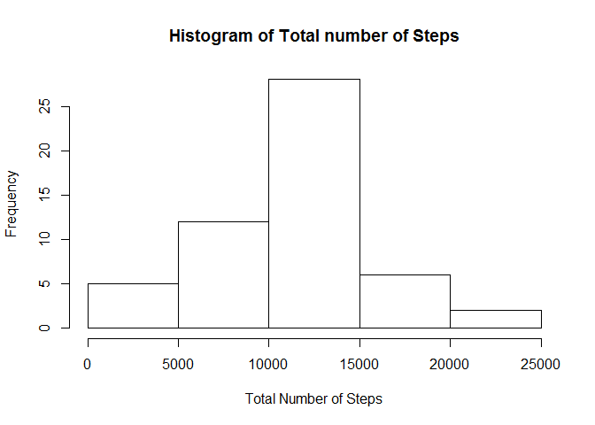

# Reproducible Research: Peer Assessment 1

## Loading and preprocessing the data

The file has been downloaded and saved in the working directory that I have set in the below code. The code below is used to read the data as a data frame in R, add columns containing the date in date form, weekdays, number of days since the recording, since these variables will be useful in our analysis.


```r
setwd("C:/Users/neeraj.chaddha/Desktop/Coursera/Data Science Specialization JHU/05 Reproducible Research/Project_1")
activity<-read.csv("activity.csv",header=TRUE)
activity$interval<-as.factor(activity$interval)
activity$date_form<-as.Date(activity$date,format="%Y-%m-%d")
activity$weekday<-format(activity$date_form,"%A")
activity$day_number<-difftime(activity$date_form,as.Date("2012-10-01",format="%Y-%m-%d"),units="days") #The variable represents the number of days since beginning.
```


## What is mean total number of steps taken per day?


```r
#Calculating point 1 and 2
total_step_per_day<-tapply(activity$steps,activity$date,sum)
hist(total_step_per_day,xlab="Total Number of Steps",main="Histogram of Total number of Steps")
```

 


```r
options(scipen=999)
mean_steps_per_days<-mean(total_step_per_day,na.rm=TRUE)
median_steps_per_days<-median(total_step_per_day,na.rm=TRUE)
```

For point 3:

The mean of total number of steps per day is 10766.

The median of total number of steps per day is 10765.


## What is the average daily activity pattern?


```r
average_steps_per_interval<-tapply(activity$steps,activity$interval,mean,na.rm=TRUE)  #This will take the average of steps for all the intervals, averaged over different days.

plot(as.numeric(names(average_steps_per_interval)),average_steps_per_interval,type="l",xlab="The 5-minute time Interval",ylab="Average number of steps taken",main="Average daily activity pattern (Time-Series plot)")
```

 

```r
max_time<- average_steps_per_interval[order(average_steps_per_interval,decreasing = TRUE)[1]]

max_time_interval<-as.numeric(names(max_time))

unname(max_time)
```

```
## [1] 206.1698
```

The interval containing the max. average number of steps is 835, and its value is 206.1698113. This interval means the 5 minutes between 8:35 am and 8:40 am


## Imputing missing values


```r
rows_missing<-nrow(activity[is.na(activity),])
```
1. The number of rows with missing values is 2304


```r
activity_new<-activity
activity_new$date<-as.character(activity_new$date)
dates<-unique(activity_new$date)
for (i in 1:length(dates)){
    s<-subset(activity_new,activity_new$date==dates[i])
    mu<-mean(s$steps,na.rm=TRUE)
    if(is.na(mu)){mu=0}
    activity_new$steps<-ifelse(is.na(activity_new$steps) & activity_new$date==dates[i],mu,activity_new$steps)
}
activity_new$date<-as.factor(activity_new$date)
```

The above code accomplishes point 2 and 3, and makes a new dataframe activity_new that replaces all the NA values for a particular day with the average number of steps for that day. This dataframe has no missing values


```r
#Histogram for point 4.
new_total_step_per_day<-tapply(activity_new$steps,activity_new$date,sum,na.rm=TRUE)
hist(new_total_step_per_day,xlab="Total Number of Steps",main="Histogram of Total number of Steps")
```

 


```r
options(scipen=999)
new_mean_steps_per_days<-mean(new_total_step_per_day)
new_median_steps_per_days<-median(new_total_step_per_day)
```


For point 4:

The mean of total number of steps per day is 9354.

The median of total number of steps per day is 10395.

We see that both, the mean and median have decreased now.This is because the NA values were replaced by the average steps for that day (in my convention). On noticing, we see that the NA values were missing for entire days, so the NA values were replaced by 0 (since no average existed for those days).

Now, since NA has been replaced by 0, the mean and median of data, both have reduced.
Also, we notice that the mean has reduced greatly and the median has reduced only slightly. This confirms the popular theory that the median is a robust statistics, while the mean is not.

## Are there differences in activity patterns between weekdays and weekends?


The below code creates a new variable 'type' which tells if its a weekend or weekday. (Saturday and Sunday are weekends, while all other days, including Friday are taken as Weekdays by convention).

```r
activity$weekday<-as.factor(activity$weekday)
activity$type<-ifelse(activity$weekday=="Saturday" | activity$weekday=="Sunday","Weekend","Weekday")
```


There is a difference between the average number of steps during the different intervals for the weekdays as well as weekends. The graph below shows, that more steps occur on Weekends a bit later than the weekday times, which can be explained by people waking up late on weekends. 


```r
activity_weekday<-subset(activity,activity$type=="Weekday")
average_steps_per_interval_1<-tapply(activity_weekday$steps,activity_weekday$interval,mean,na.rm=TRUE)  #This will take the average of steps for all the intervals, averaged over different days.

activity_weekend<-subset(activity,activity$type=="Weekend")
average_steps_per_interval_2<-tapply(activity_weekend$steps,activity_weekend$interval,mean,na.rm=TRUE)  #This will take the average of steps for all the intervals, averaged over different days.

par(mfrow=c(2,1))

plot(as.numeric(names(average_steps_per_interval_1)),average_steps_per_interval_1,type="l",xlab="The 5-minute time Interval",ylab="Average number of steps taken",main="Weekday_Average daily activity pattern (Time-Series plot)")


plot(as.numeric(names(average_steps_per_interval_2)),average_steps_per_interval_2,type="l",xlab="The 5-minute time Interval",ylab="Average number of steps taken",main="Weekend_Average daily activity pattern (Time-Series plot)")
```

 


